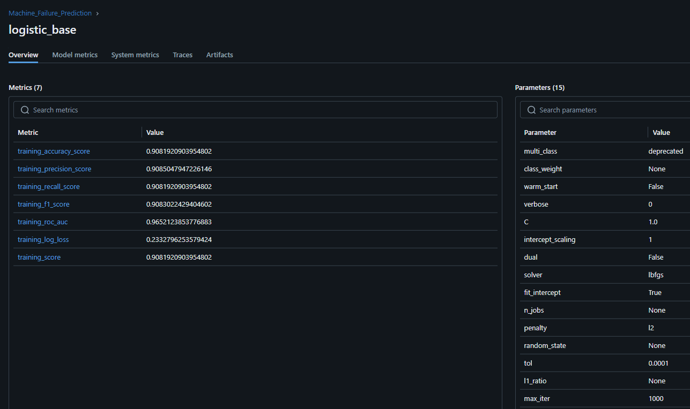
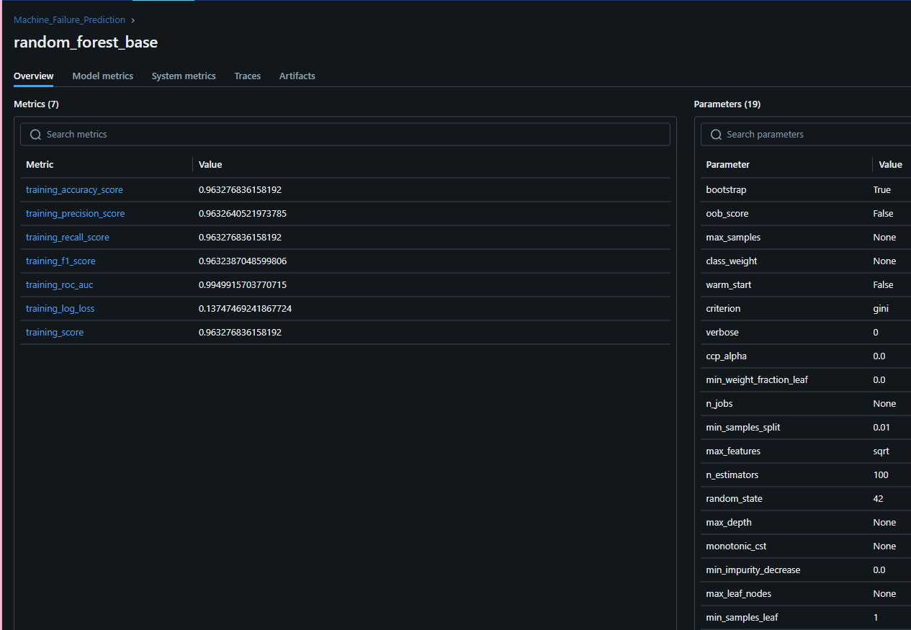

# machine_failure_prediction
Simple [Kaggle dataset](https://www.kaggle.com/datasets/umerrtx/machine-failure-prediction-using-sensor-data/data "Machine Failure Prediction")

A machine learning project focused on predicting industrial machine failures using sensor data. This project demonstrates:
- Systematic ML experimentation with MLflow tracking
- Feature engineering and evaluation approaches
- Model selection and evaluation processes
- Data-driven decision making

The goal was to achieve >87% prediction accuracy while learning MLflow's experiment tracking capabilities.

## Methodology

### Data Analysis and Preprocessing
- Analyzed feature correlations to identify most predictive variables
- Dropped low-correlation features to improve model performance
- Split data using 75/25 train/test with random seed 0 for final evaluation

### Feature Engineering
Explored multiple feature engineering approaches including:
- Safety state indicators for discrete variables
- Temperature and operational mode interactions
- Electrical system relationship features

Interestingly, the base features outperformed engineered features for this dataset.

### MLflow Implementation
Utilized MLflow for experiment tracking with:
- Automatic parameter logging
- Cross-validation metrics tracking
- Model artifacts storage
- Experiment organization by model type and feature sets

## Results
Using MLFlow locally, I did some CV testing to see how 3 models would perform on the small dataset I found.
I employed some light feature engineering to make more data out of what variables could be correlated (whether directly or indirectly) to system failure. 

I quickly found the following:
- DecisionTrees performed poorly
- LogisticRegression performed consistently well (>0.9 accuracy, F1, precision, and recall)
- RandomForests were consistently the runner-up right next to Log. Regr.
- Base features worked the best for the models

Here are the model results:

- LogisticRegression - BASE CV/Test Accuracy: ~0.91/0.93:
- 
- RandomForestClassifier - BASE CV/Test Accuracy: ~0.9/0.92:
- 

## Key Learnings

- **MLflow Benefits**: Rapid experimentation and comparison between models became significantly easier with organized tracking
- **Model Selection**: Simpler models (LogisticRegression) sometimes outperform more complex ones
- **Feature Engineering**: Not always necessary when base features already capture key relationships
- **Data Efficiency**: Even with a relatively small dataset (~940 rows), achieved >90% accuracy

## Future Work

- Create coefficient interpretation visualization for LogisticRegression model
- Implement a simple prediction API using Flask or FastAPI
- Add feature importance analysis for RandomForest model
- Explore hyperparameter tuning with MLflow

## Setup and Usage

```bash
# Clone repository
git clone https://github.com/yourusername/machine_failure_prediction.git

# Install dependencies
pip install -r requirements.txt

# Run experiments
python run_experiments.py

# View MLflow UI
mlflow ui